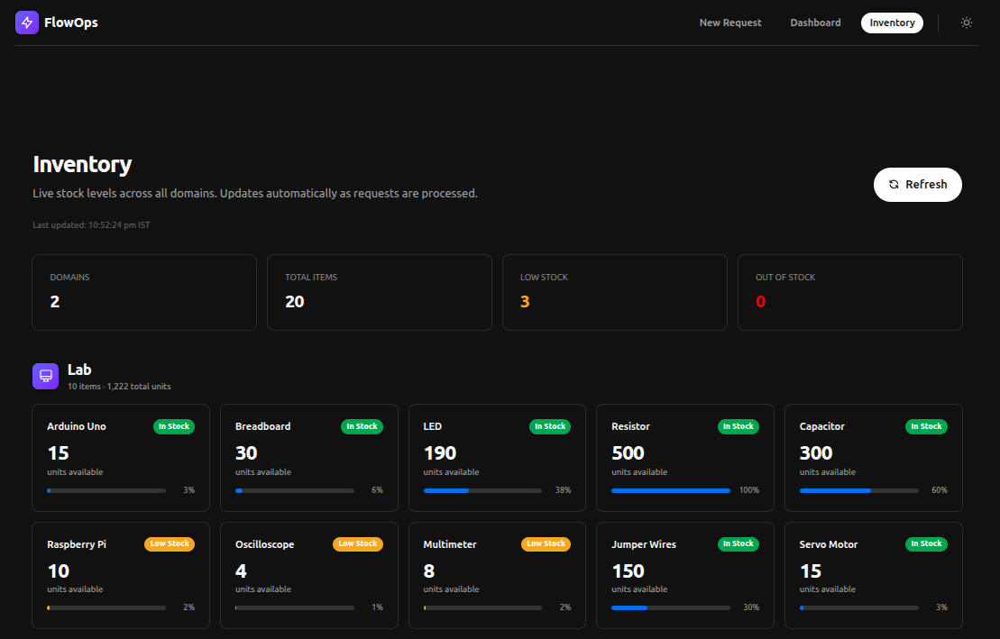
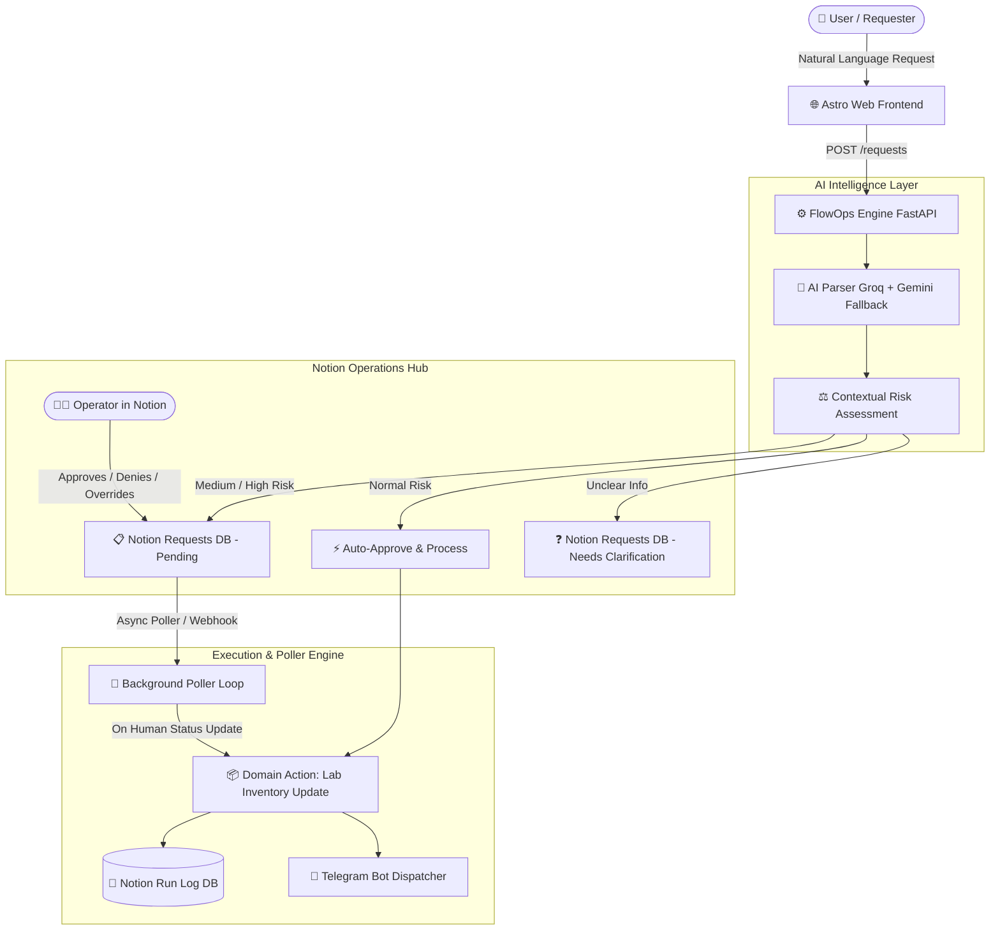

# ⚡ FlowOps — Autonomous Operations Engine with Notion Control & Real-Time Dispatch

> **Automating repetitive operational workflows with Notion as the Human-in-the-Loop interface and external real-world action execution.**

[](https://notion.so)
[](https://astro.build)
[](https://fastapi.tiangolo.com)
[](https://groq.com)
[](https://telegram.org)

---

## 📸 Proof of Execution & Visual Walkthrough

> *Screenshots demonstrating the complete end-to-end flow: from natural language request submission to Notion Human-in-the-Loop decision-making, autonomous polling, backend execution, live inventory updates, and instant Telegram dispatch.*

---

### 1️⃣ User Portal & Live Inventory (Frontend UI)

Requesters submit natural language orders through an Astro-powered frontend with real-time status tracking and inventory visibility.

| Natural Language Request Submission | Live Request Tracking & Status Dashboard |
| :---: | :---: |
|  |  |
| *Users submit freeform text (e.g. "Need 3 Oscilloscopes and 1 Arduino for testing")* | *Real-time status tracking, risk levels, and timestamps* |

| Live Hardware & Lab Inventory State |
| :---: |
|  |
| *Real-time component stock tracking with instant stock synchronization* |

---

### 2️⃣ Notion as the Human-in-the-Loop Control Center

Operational requests are automatically routed into Notion databases. High-risk or ambiguous requests pause for operator review.

| Notion Requests Database (Live Hub) | Individual Request Card View |
| :---: | :---: |
|  |  |
| *Multi-column database with risk level, status dropdowns, and processed flags* | *Parsed JSON payload, sender metadata, and decision parameters inside Notion* |

---

### 3️⃣ Autonomous Poller Engine & Backend Execution

The FastAPI backend continuously monitors Notion via zero-dependency async polling (10s interval) or webhooks, executing domain mutations instantly upon status change.

| FastAPI Backend Server & Poller Logs |
| :---: |
|  |
| *Terminal log showing AI parsing (Groq/Gemini), poller status detection, inventory deduction, and Telegram dispatch* |

---

### 4️⃣ Real-Time Telegram Dispatch & Immutable Run Log Audit

Once processed, status updates and dispatch receipts are instantly sent to Telegram, and an immutable audit log is committed to Notion.

| Telegram Notification (Approved) | Telegram Notification (Clarification) | Mobile Client Live Feed (Pending & Approved) |
| :---: | :---: | :---: |
|  |  |  |
| *Itemized component breakdown & IST timestamp* | *Immediate notification prompting clarification* | *Live mobile Telegram feed showing real-time pending alerts and approved dispatches* |

| Immutable Notion Run Log Database (Audit Trail) |
| :---: |
|  |
| *Complete audit trail tracking every action, executing actor, status result, and execution timestamp* |

---

## 📌 1. Overview & Problem Statement

Every college lab, workshop, club, and small organization faces repetitive manual bottlenecks:
- Requests submitted in messy natural language across chat groups.
- Manual tracking in spreadsheets where items get lost or delayed.
- Bottlenecks in inventory and approvals without clear audit trails.

**FlowOps** solves this by turning **Notion into an operational command center** driven by an autonomous backend engine:
1. **Inbound Trigger:** Users submit requests in natural language (via web UI or API).
2. **AI Parsing & Multi-Factor Risk Assessment:** Deep extraction of quantities, components, and context; evaluates risk (*Normal*, *Medium*, *High*).
3. **Notion as the Control Panel:**
   - **Normal Risk:** Auto-approved instantly, logged, and executed.
   - **Medium / High Risk / Ambiguous:** Pauses for human review inside Notion (*Pending* / *Needs Clarification*).
4. **Autonomous Polling & Webhook Engine:** Listens for human decisions made directly in Notion (*Approved*, *Denied*, *Needs Clarification*).
5. **Real-World Action & Audit Proof:** Updates real-world domain states (e.g. lab hardware inventory), writes an immutable row in the Notion **Run Log**, and dispatches structured **Telegram alerts**.

---

## 🏗️ 2. System Architecture



---

## 🚀 3. Key Features

- **🧠 Contextual AI Parsing & Fallbacks:** Uses Groq (primary) with seamless Gemini fallback to turn free-text prompts into structured JSON without hardcoded dictionaries.
- **⚖️ Dynamic Multi-Factor Risk Routing:** Evaluates safety, quantity relative to item value, and operational impact.
- **📋 Notion as the True Control Panel:** Operators review, approve, deny, or ask for clarification directly inside Notion.
- **🔄 Zero-Paid-Tier Dependency:** Functions autonomously via an asynchronous cron poller loop (10s interval) or direct HTTP webhooks.
- **📱 Rich Telegram Dispatch:** Real-time formatted notifications with dynamic component itemization, status headers, request IDs, and IST timestamps.
- **📗 Verifiable Run Log Audit Trail:** Writes every single executed action to an immutable Notion Run Log database with timestamps and actor attribution.

---

## 📱 4. Telegram Notification Schema

All status transitions trigger clear, structured Telegram messages with dynamic item bullets:

| Approved Request | Request Needs Clarification | Denied Request |
| :--- | :--- | :--- |
| <pre>✅ <b>Lab Request Approved</b><br/>🔖 Request ID: E2A199FB<br/>👤 Issued to: user_123<br/>📦 Items:<br/>  • 1x Arduino Uno<br/>  • 2x LED<br/>🕐 2026-08-21 20:21 IST</pre> | <pre>❓ <b>Request Needs Clarification</b><br/>🔖 Request ID: E2A199FB<br/>👤 Issued to: user_123<br/>📦 Items:<br/>  • 1x Arduino Uno<br/>  • 2x LED<br/>🕐 2026-08-21 20:21 IST</pre> | <pre>❌ <b>Request Denied</b><br/>🔖 Request ID: E2A199FB<br/>👤 Issued to: user_123<br/>📦 Items:<br/>  • 1x Arduino Uno<br/>  • 2x LED<br/>🕐 2026-08-21 20:21 IST</pre> |

---

## 📂 5. Project Structure

```
FlowOps/
├── backend/
│   ├── actions/
│   │   ├── lab.py              # Inventory decrement/increment & state mutation
│   │   └── restaurant.py       # Restaurant order domain handler
│   ├── data/
│   │   └── inventory.json      # Atomic persistent inventory store
│   ├── schemas/
│   │   ├── lab.json            # Lab domain JSON schema
│   │   └── restaurant.json     # Restaurant domain JSON schema
│   ├── ai_client.py            # Groq + Gemini LLM client with automatic failover
│   ├── core.py                 # Request pipeline controller (Parse -> Route -> Act)
│   ├── main.py                 # FastAPI application with background lifespan poller
│   ├── notion_helper.py        # Notion API integration, card creator, run logger
│   ├── parser.py               # Natural language extraction prompt & parser
│   ├── poller.py               # Autonomous Notion database poller for status changes
│   ├── router.py               # Multi-factor risk assessment & approver routing
│   ├── telegram_helper.py      # Rich Telegram Bot API messaging client
│   ├── requirements.txt        # Python backend dependencies
│   └── .env.example            # Backend environment variables template
│
├── frontend/
│   ├── src/
│   │   ├── components/         # Astro & UI components (RequestForm.astro)
│   │   ├── layouts/            # Base layouts (Layout.astro)
│   │   ├── pages/              # index.astro, dashboard.astro, inventory.astro
│   │   └── styles/             # Global CSS styling
│   ├── astro.config.mjs        # Astro configuration
│   └── package.json            # Node.js dependencies
│
├── img/                        # Proof of execution & UI screenshots
│   ├── User Form.png
│   ├── User Dashboard.png
│   ├── Inventory.png
│   ├── Requests DB.png
│   ├── Request Notion Card.png
│   ├── Backend Terminal Output.png
│   ├── Telegram Bot Notification eg1.png
│   ├── Telegram Bot Notification eg2.png
│   ├── Telegram Bot Notification eg3.png
│   └── Run log DB.png
│
└── README.md                   # Project documentation & setup guide
```

---

## 🛠️ 6. Setup & Installation

### Prerequisites
- **Python:** 3.10 or higher
- **Node.js:** 18.x or higher
- **Notion Integration Token & Database IDs**
- **Telegram Bot Token & Chat ID**

---

### Step 1: Backend Configuration

1. Navigate to the backend directory and set up a virtual environment:
   ```bash
   cd backend
   python3 -m venv venv
   source venv/bin/activate
   pip install -r requirements.txt
   ```

2. Configure your environment variables:
   ```bash
   cp .env.example .env
   ```
   Edit `.env` with your API credentials:
   ```ini
   # LLM Keys
   GROQ_API_KEY=gsk_...
   GEMINI_API_KEY=AI...

   # Notion Integration
   NOTION_API_KEY=secret_...
   NOTION_REQUESTS_DB_ID=your_requests_database_id
   NOTION_RUN_LOG_DB_ID=your_run_log_database_id

   # Telegram Bot
   TELEGRAM_BOT_TOKEN=123456789:ABC...
   TELEGRAM_CHAT_ID=your_chat_id
   ```

#### 🔑 How to Obtain Each API Key (Quick Guide)

| Key / Variable | Source | Quick Steps to Get It |
| :--- | :--- | :--- |
| **`GROQ_API_KEY`** | [Groq Console](https://console.groq.com/keys) | Sign in → Click **Create API Key** → Copy the key (`gsk_...`). |
| **`GEMINI_API_KEY`** | [Google AI Studio](https://aistudio.google.com/app/apikey) | Sign in → Click **Create API Key** → Select project → Copy key (`AI...`). |
| **`NOTION_API_KEY`** | [Notion Developers](https://www.notion.so/profile/integrations) | Click **+ New integration** → Name it `FlowOps` → Copy **Internal Integration Secret** (`secret_...`). |
| **`NOTION_REQUESTS_DB_ID`**<br/>**`NOTION_RUN_LOG_DB_ID`** | Notion Database Pages | 1. Open your Notion database in browser.<br/>2. Click `•••` (top-right) → **Connect to** → Select `FlowOps`.<br/>3. Click **Share** → **Copy link**: The 32-character string between the last `/` and `?v=` is your Database ID:<br/>`https://notion.so/{DATABASE_ID}?v=...` |
| **`TELEGRAM_BOT_TOKEN`** | [@BotFather](https://t.me/BotFather) on Telegram | Open Telegram → Message `@BotFather` → Send `/newbot` → Name your bot → Copy the HTTP API token (`123456:ABC...`). |
| **`TELEGRAM_CHAT_ID`** | Telegram User / Group | Send `/start` to your new bot, then message [@userinfobot](https://t.me/userinfobot) or open `https://api.telegram.org/bot<TELEGRAM_BOT_TOKEN>/getUpdates` to find your numeric ID (`123456789`). |

3. Start the backend server:
   ```bash
   python main.py
   # Or: uvicorn main:app --host 0.0.0.0 --port 8000 --reload
   ```

---

### Step 2: Frontend Setup

1. In a new terminal, navigate to the frontend directory:
   ```bash
   cd frontend
   npm install
   npm run dev
   ```
2. Open [http://localhost:4321](http://localhost:4321) in your browser.

---

### Step 3: Notion Database Schema

#### 1. Requests Database (`NOTION_REQUESTS_DB_ID`)
- `Name` (*Title*): Human-readable summary (e.g. `Lab Request — user_123 — 2x Arduino Uno`)
- `status` (*Select*): `Pending`, `Approved`, `Denied`, `Needs Clarification`, `Auto-Approved`
- `domain` (*Select*): `lab`, `restaurant`
- `sender_id` (*Rich Text*): Requester user ID
- `risk_level` (*Select*): `NORMAL`, `MEDIUM`, `HIGH`
- `event_type` (*Select*): `issue component`, `return component`
- `details` (*Rich Text*): Structured JSON representation
- `Processed` (*Checkbox*): Checkbox tracked by the autonomous poller

#### 2. Run Log Database (`NOTION_RUN_LOG_DB_ID`)
- `Name` (*Title*): Summary of execution (e.g. `Manually Approved — issue component — human approver`)
- `action_taken` (*Rich Text*): Action executed
- `actor` (*Rich Text*): `system`, `human approver`, or `system poller`
- `timestamp` (*Date*): Execution ISO timestamp
- `result` (*Select*): `Auto-Approved`, `Manually Approved`, `Denied`, `Needs Clarification`

---

## 📡 7. API Reference

| Method | Endpoint | Description |
| :--- | :--- | :--- |
| `POST` | `/requests` | Submit a natural language request payload (`text`, `domain`, `sender_id`) |
| `GET` | `/requests` | Fetch all historical requests directly from Notion |
| `GET` | `/inventory` | Fetch real-time available stock levels |
| `GET` | `/poll/trigger` | Manually fire an instant Notion database poll cycle |
| `POST` | `/webhooks/notion` | Receive inbound Notion automation webhook payloads |
| `GET` | `/health` | Health check endpoint |

---

## 🧪 8. End-to-End Verification Flow

1. **Submit Request:**
   Submit `"I need 1 Arduino Uno and 2 LEDs for my IoT lab assignment"` via the frontend UI (see `img/User Form.png`).
2. **AI Categorization & Routing:**
   The backend extracts the items, identifies risk parameters, and creates a `Pending` card in Notion (see `img/Requests DB.png` & `img/Request Notion Card.png`).
3. **Human Approval in Notion:**
   Open Notion, change the card's `status` dropdown to **`Approved`**.
4. **Autonomous Poller Execution:**
   Within 10 seconds, the poller detects the status update, decrements inventory in `backend/data/inventory.json` (reflected in `img/Inventory.png`), writes an immutable entry in the **Run Log** database (see `img/Run log DB.png`), and marks the card as `Processed` (captured in backend logs: `img/Backend Terminal Output.png`).
5. **Telegram Dispatch:**
   A Telegram alert with full component breakdowns and IST timestamp arrives immediately on both desktop and mobile clients (see `img/Telegram Bot Notification eg1.png`, `img/Telegram Bot Notification eg2.png`, and mobile live feed in `img/Telegram Bot Notification eg3.png`).

---

## 📜 9. License

MIT License — Built for the Hackathon Notion Track.
